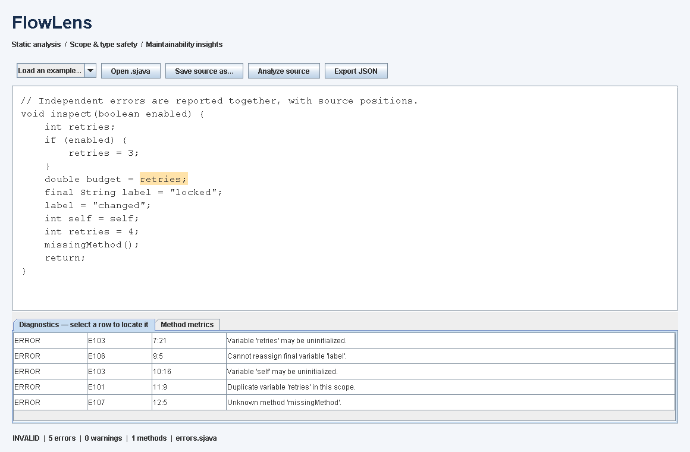

# FlowLens — Java Static Analyzer

[](https://github.com/shayb1187-a11y/flowlens-java-analyzer/actions/workflows/ci.yml)


**Catch type, scope, and initialization errors before running code.** FlowLens is a static analyzer written in Java 17 for s-Java, a deliberately limited Java-like language. A shared analysis engine powers a command-line interface and a Swing desktop workbench, with source-linked diagnostics, JSON reports, and code-quality metrics.

The core engineering challenge is **definite assignment across branches**: a variable is safe to read only when every path that reaches the read has initialized it. The implementation combines a recursive-descent parser, immutable syntax tree, and separate semantic and lint visitors.

**Start here:** [Architecture and tradeoffs](docs/ARCHITECTURE.md) · [Test evidence](docs/TESTING.md) · [Language specification](docs/LANGUAGE.md) · [Download](https://github.com/shayb1187-a11y/flowlens-java-analyzer/releases/latest)



## Run it

Install a **JDK 17 or later**, clone the repository, and run the commands below. The Maven Wrapper downloads the pinned Maven version on first use, so Maven itself does not need to be installed. The application has no runtime dependencies; JUnit is test-scoped.

```sh
git clone https://github.com/shayb1187-a11y/flowlens-java-analyzer.git
cd flowlens-java-analyzer
./mvnw verify          # Windows: mvnw.cmd verify
java -jar target/flowlens.jar gui
```

To try the desktop demo without compiling, download `flowlens.jar` from the [latest release](https://github.com/shayb1187-a11y/flowlens-java-analyzer/releases/latest), then run it with Java 17 or later:

```sh
java -jar flowlens.jar gui
```

A graphical desktop is required for `gui`. A headless server can run the CLI:

```sh
java -jar target/flowlens.jar check examples/valid.sjava
java -jar target/flowlens.jar check examples/errors.sjava
java -jar target/flowlens.jar check --format=json examples/errors.sjava
java -jar target/flowlens.jar check --warnings-as-errors examples/lint.sjava
java -jar target/flowlens.jar check --no-lint examples/valid.sjava examples/branching.sjava
```

The errors example intentionally returns exit code **1**. Exit codes are **0** for valid source, **1** for source errors or a failed warning gate, and **2** for argument or file-access failures. A batch analyzes files independently and gives I/O failures precedence. `--warnings-as-errors` changes the exit status; warnings remain warnings in reports, and JSON `valid` still describes source validity.

`./mvnw verify` compiles with warnings as errors, runs the JUnit suite, packages `target/flowlens.jar`, runs the packaged JAR in an integration test, and enforces the JaCoCo coverage gate. The coverage report is written to `target/site/jacoco/index.html`. `./mvnw package -DskipTests` builds the JAR only, and `./mvnw clean` deletes `target/`.

## What it demonstrates

| Capability | Concrete implementation |
| --- | --- |
| Compiler front end | Tokenizer, recursive-descent parser, precedence, immutable AST, bounded recursion, statement recovery |
| Semantic analysis | Forward calls, lexical scopes, shadowing, final variables, method signatures, centralized type rules |
| Data-flow reasoning | Initialization sets keyed by declaration identity; copies and intersections at branches; isolated method state |
| Developer feedback | Multiple diagnostics with codes, severity, line, column and offset; text and versioned JSON reports |
| Extensibility | Pluggable lint rules and report strategies; the core has no filesystem, console, or Swing dependencies |
| Desktop demo | Source editor, four examples, background analysis, diagnostic navigation, metrics, source saving, JSON export |
| Engineering discipline | Maven build; 113 JUnit 5 tests; JaCoCo coverage gate; warnings-as-errors compilation; seeded malformed-input checks; Windows/Linux and JDK 17/21 CI |

The default lint rules cover method naming, excessive complexity/nesting, and unreachable statements. Metrics report statement count, cyclomatic complexity, and maximum control nesting for each method.

## How branch analysis catches a bug

```java
void inspect(boolean enabled) {
    int retries;
    if (enabled) {
        retries = 3;
    }
    double budget = retries; // E103: the branch might not execute
    return;
}
```

Adding an `else` branch that assigns `retries` makes this valid. A branch that returns does not contribute to the initialization requirements of later statements. The analysis deliberately assumes a loop may execute zero times.

## OOP design

| Concept / pattern | Where it is used | Why it belongs |
| --- | --- | --- |
| Composite | `Ast.Node`, blocks, statements, and expressions | Nested syntax forms a tree with one traversal contract |
| Visitor | `Ast.Visitor<R>`, `SemanticAnalyzer`, `MetricsCollector`, `TreeWalker` | Type checking, measurement, and lint traversal evolve as separate operations |
| Strategy | `ReportFormatter` and its text/JSON implementations | Output format changes without changing analysis |
| Rule composition | `AnalysisRule` and `Analyzer`'s immutable rule list | Teams can add or disable warnings without editing parser or semantic logic |
| Facade | `Analyzer.analyze(SourceUnit)` | Both front ends use one small, in-memory API |
| Dependency inversion | `Cli` depends on `SourceRepository` | File I/O is replaceable; CLI tests use in-memory adapters |
| Encapsulation and composition | `Scope`, `VariableSymbol`, `FlowState`, `TypeRules` | A symbol's identity and modifiers are distinct from facts about a control-flow path |

Records are used for immutable values; behavior belongs in visitors and collaborators. There is no global symbol table and no Singleton. The Visitor tradeoff is explicit: adding an operation is easy, while adding a node kind requires updating the visitor contract and relevant implementations.

See [architecture and design decisions](docs/ARCHITECTURE.md) for diagrams and extension examples.

## Repository guide

- `src/main/java/dev/sjavainspector/api/`: stable entry point, immutable inputs and results.
- `syntax/`: lexer, tokens, parser, AST, and default traversal.
- `semantic/`: type checking, name resolution, scope ownership, and flow state.
- `lint/`: measurements and independent warning rules.
- `io/`, `report/`, `cli/`, `ui/`: adapters and application entry points.
- `src/test/java/`: JUnit 5 tests mirroring the main packages: front-end, semantic, lint, CLI, reporting, concurrency, and desktop. `*IT` classes run against the packaged JAR.
- `examples/`: runnable demo inputs.
- `docs/`: [language specification](docs/LANGUAGE.md), [original-code review](docs/REVIEW.md), [verification record](docs/TESTING.md), and [portfolio/interview guide](docs/PORTFOLIO.md).

## Scope and provenance

FlowLens is an educational static analyzer for the documented s-Java dialect. It does not execute source code. Arithmetic, comparisons, classes, imports, arrays, overloads, non-void methods, numeric range evaluation, and interprocedural side-effect inference are outside its scope.

The project began as an academic verifier using two passes, regular expressions, and a shared symbol table. A subsequent assisted redesign replaced the parser and state model while retaining the verification problem and two-stage semantic analysis. This edition adds `else`, logical grouping/negation, flexible whitespace, escapes, and comments. The [baseline review](docs/REVIEW.md) documents reproduced defects and the design changes. Compatibility with the original course grader is not claimed.

See the [verification record](docs/TESTING.md) for tested behavior and limitations, and the CI badge above for the current hosted build status.
