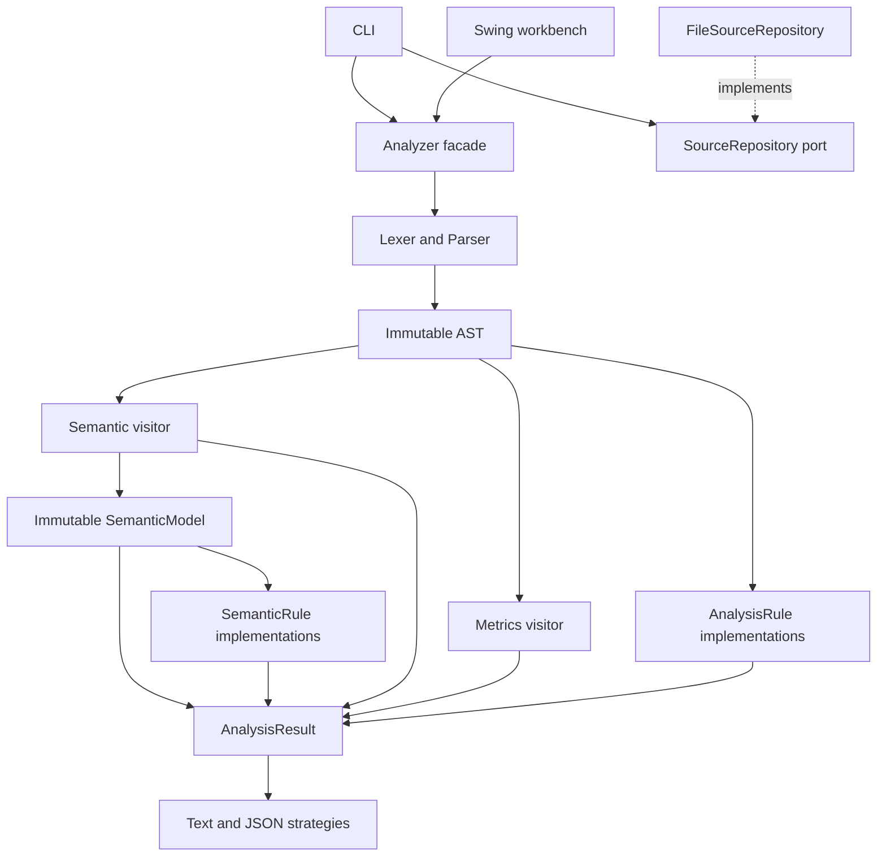
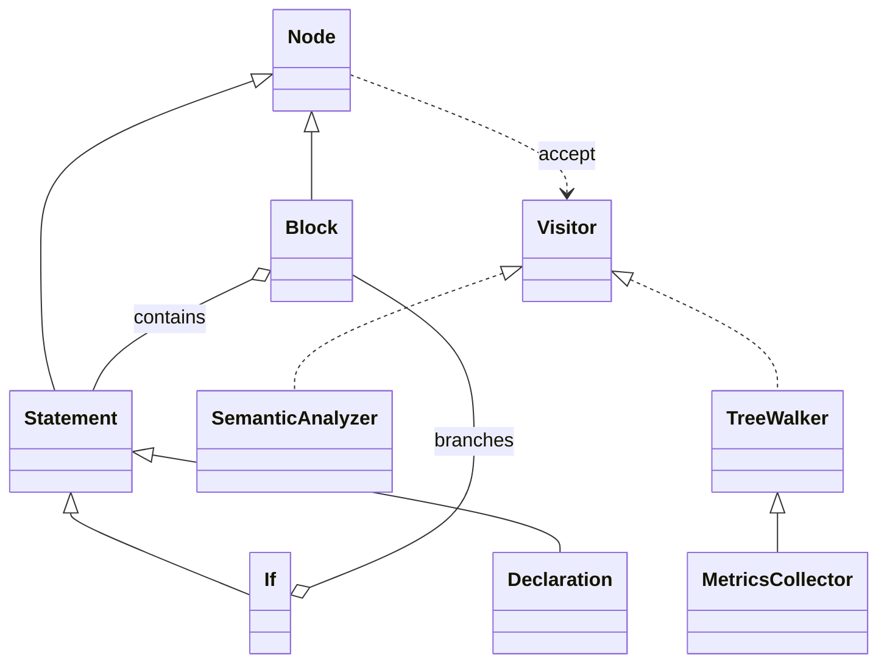
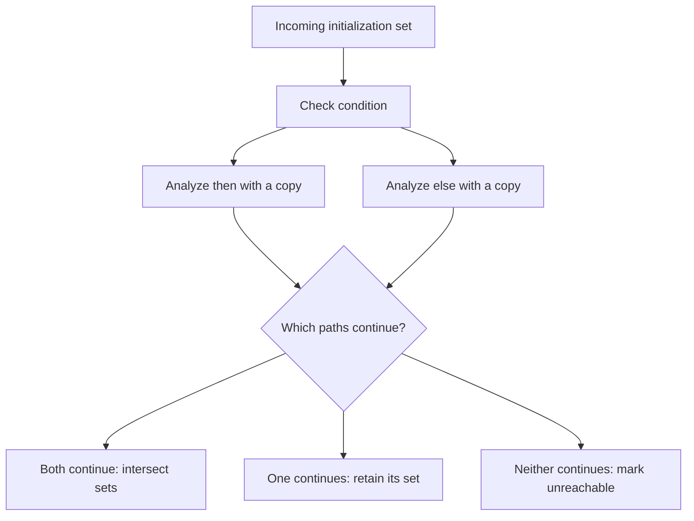

# Architecture and design decisions

## Boundaries



`Analyzer` accepts a `SourceUnit` rather than a path. This prevents analysis from depending on storage, output streams, or a UI. It creates fresh scanners, parsers, visitors, and diagnostic lists for each call. Its only long-lived state is defensively copied lists of syntax and semantic lint rules. The built-in rules have no mutable per-run state. Custom rules must honor the same thread-safety contract.

There is no dependency-injection framework: `Main` is the composition root, the CLI receives a source port through its constructor, and the facade receives lint strategies through its constructor. One `TypeRules` implementation is enough for this single dialect; it does not need an interface with only one useful implementation.

## Syntax as objects

`Ast.Node` is a sealed interface. Immutable records model methods, blocks, declarations, assignments, calls, control statements, and expressions. Every collection is copied on construction. A `Variable` expression contains a name and position; a resolved `VariableSymbol` belongs to semantic analysis, not parsing.



The AST is a **Composite** structure. `accept` plus the typed visitor methods implement **Visitor** using double dispatch. `SemanticAnalyzer` directly implements the complete visitor contract because every node needs an explicit meaning. `MetricsCollector` specializes `TreeWalker` to reuse traversal. `UnreachableCodeRule` uses an anonymous walker with local state, so its reusable rule object stays stateless.

Why not put `validate()`, `measure()`, and `render()` on every node? That would tie the syntax model to unrelated operations. Why not use a giant `instanceof` switch for semantic analysis? A visitor makes the set of handled node types explicit at compile time. A small structural predicate in the unreachable-code lint rule remains appropriate: it only asks whether a statement definitely terminates.

**Cost:** the AST is intentionally closed. Adding a new syntax kind means updating its sealed hierarchy, parser, visitor interface, semantic visitor, and traversal. Visitor favors adding operations over frequently adding node types. This is a tradeoff, not a universal best practice.

## Scope and flow are different things

`Scope` owns declarations and resolves names through parent scopes. `VariableSymbol` owns an immutable type, name, final flag, kind, and name range. Object identity distinguishes two declarations with the same name; symbols deliberately do not override `equals`.

`FlowState` owns a set of definitely initialized symbols and a reachability flag. Assignment adds a fact to that set; it never replaces a declaration object or changes whether a name was declared locally. That prevents the original bug where assigning to a variable erased its declaration metadata.



Without an `else`, the unexecuted branch carries the incoming state. Assignments in a loop body are checked but do not become definite after the loop. Facts about branch-local declarations are removed when leaving their scope; assignments to enclosing declarations remain part of that branch's result.

The analyzer checks unreachable source for semantic errors but emits a separate configurable warning for unreachable statements. It does not infer constant conditions or try to prove termination of loops.

## The semantic model

`SemanticAnalyzer.analyze` records facts as it resolves names, then freezes them into a `SemanticModel`:

- **Symbols:** every global, local, parameter, and method declaration, with its owning scope, name range, type or parameter types, and final flag. A rejected duplicate stays in the model with `isAccepted() == false` but never enters its scope, so it cannot replace the accepted declaration.
- **Scopes:** a global scope, one scope per method (shared by parameters and top-level locals), and one per block, linked by parent and child.
- **References:** each identifier use as a `READ`, `WRITE`, or `CALL`, with its range, containing scope, and resolved symbol if there is one. In `int x = x;` the read binds to the new `x`, which is why it is reported as uninitialized.
- **Shadowing:** when a declaration is accepted, resolving its name through the parent scopes at that moment records which variable it hides.
- **Expression types:** the type the analyzer computed for each expression node, `ERROR` included, keyed by node identity.

`FlowState` keys on the same `VariableSymbol` objects the model exposes, so definite assignment and the model cannot disagree about which declaration a name means. Lint rules implement `SemanticRule` and read bindings from the model; they never resolve names themselves.

Ranges are half-open and measured in UTF-16 code units, matching `SourcePosition` offsets and columns. `symbolAt` and `referenceAt` binary-search a sorted index of name ranges. **Model identities belong to one source snapshot.** Symbols, scopes, and AST nodes are compared by identity, so after an edit the source must be analyzed again and old symbols must not be mixed with the new model. The model is built on every successful parse, including invalid programs, but not after input-limit, lexical, parse, or I/O failures.

## Two-stage semantic analysis

1. Register all method signatures, detecting duplicate names. This permits forward calls and recursion without executing anything.
2. Process global statements in source order, then check each method against an independent copy of the completed global initialization state. Method parameters start initialized and share a scope with the method's top-level locals.

Calls check existence, argument count, argument initialization, and compatible types. They do not establish facts about globals. For example, calling `initialize()` does not prove that another method initialized a global. This deliberate intraprocedural limit avoids depending on call order or pretending to have whole-program analysis.

`Type.ERROR` is a sentinel for a previously reported expression failure. It suppresses redundant type errors, and it never initializes a variable. This is preferable to exceptions for ordinary invalid user source.

## Extending behavior through composition

A new report format implements `ReportFormatter`; analysis classes need no changes. A rule receives the immutable AST and metrics and returns diagnostics:

```java
AnalysisRule publicApiLimit = (program, metrics) -> {
    if (program.methods().size() <= 10) return List.of();
    return List.of(Diagnostic.warning(
        "TEAM001", "Consider splitting this source into smaller units.",
        program.position()));
};

Analyzer analyzer = new Analyzer(List.of(
    new MethodNamingRule(),
    new ComplexityRule(5, 2),
    new UnreachableCodeRule(),
    publicApiLimit));
AnalysisResult result = analyzer.analyze(new SourceUnit("demo.sjava", source));
```

Imports are from `dev.sjavainspector.api`, `dev.sjavainspector.lint`, and `java.util.List`. Passing an empty rule list disables lint; semantic validation itself remains mandatory.

Rules that need resolved names implement `SemanticRule` and receive the frozen model. They are passed as a second list, `new Analyzer(syntaxRules, semanticRules)`, or taken from `Analyzer.withSemanticLint()`. Semantic rules run only when validation found no errors:

```java
SemanticRule tooManyGlobals = model -> model.globalScope().declarations().size() <= 20
        ? List.of()
        : List.of(Diagnostic.warning("TEAM002", "Prefer fewer globals.", model.program().position()));
Analyzer analyzer = new Analyzer(Analyzer.defaultRules(), List.of(tooManyGlobals));
```

The rule list is **not Chain of Responsibility**: every rule runs, and no rule consumes a request or decides whether another rule receives it. The analysis stages are a pipeline, not a reason to label everything a design pattern. No Factory, Builder, Observer bus, or State pattern was added without a need. Swing listeners already handle UI events.

## SOLID applied carefully

| Principle | Concrete evidence | Boundary / limitation |
| --- | --- | --- |
| Single responsibility | Lexer owns tokenization; parser owns grammar; semantic visitor owns language meaning; formatters own serialization | The semantic visitor coordinates related checks; splitting each statement into a service would obscure flow |
| Open/closed | Add lint rules and formatters by implementing small interfaces | New grammar constructs intentionally require edits to the compiler front end |
| Liskov substitution | Either formatter can serialize the same results; repository adapters share an I/O contract | This does not mean every class needs a base class |
| Interface segregation | Small `SourceRepository`, `ReportFormatter`, `AnalysisRule`, and `SemanticRule` contracts | The complete visitor is deliberately larger because the language's node set is closed |
| Dependency inversion | CLI tests inject a source port; core analysis depends only on text and value objects | Composition roots are allowed to construct concrete implementations |

## Failures, limits, and threading

- Lexical and parser errors are diagnostics. A private lightweight exception only unwinds the parser to a recovery boundary; it never escapes the public analysis API for malformed source.
- Semantic errors accumulate. Diagnostics are sorted by source offset, severity, and code.
- A source may contain at most 1,000,000 UTF-16 characters; disk input is capped at 4,000,000 bytes. Blocks are limited to depth 64 and expressions to a parsing budget of 128 parts. These are explicit limits, not a claim of adversarial-service hardening.
- The core does not catch arbitrary programming exceptions from custom rules. A broken extension should fail visibly rather than make a source look valid.
- Swing analysis runs in a `SwingWorker`; only the event thread updates widgets. A revision counter discards results whose source snapshot has changed, including changes to the source filename after saving.
- File dialogs and source saves are desktop-adapter concerns. A server API, if ever added, should call the facade and establish its own workload and concurrency limits.

## Build decisions

The standard `src/main/java` and `src/test/java` layout is retained. A small JDK-only build driver makes the entire demo reproducible offline with one prerequisite. Compilation uses `--release 17 -Xlint:all -Werror`. Tests have an explicit assertion runner that works without `-ea`.

This choice avoids a network bootstrap in this delivery. It is not a claim that custom build tooling is generally better than Maven/Gradle or JUnit. If a team adopts the project, moving the existing behavioral cases into its standard test framework is a straightforward tooling change; the production architecture does not depend on the runner.
